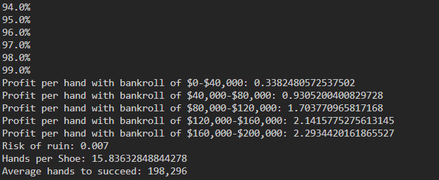

# Blackjack Calculator
## This repository has several versions of calculators for Blackjack. The 7th and final one is what's important
### This command line tool takes in 0 or more arguments, but here is the output with the default ones:

### It simulates millions of hands of a card counter playing blackjack. The card counter employs [kelly betting](https://en.wikipedia.org/wiki/Kelly_criterion), [basic strategy](https://en.wikipedia.org/wiki/Blackjack#Basic_strategy), [card counting](https://en.wikipedia.org/wiki/Card_counting) and playing deviations to gain an edge on the house. The purpose of the simulaton is to calculate the approximate risk of ruin(or the chance that the card counter goes bankrupt) and expected value(or EV) of each hand in dollars at each level of bankroll. With default arguments, the card counter has a 0.4% risk of ruin, or 1 in ~300.

# Usage
## Clone the repository and navigate to `Blackjack-Calculator/v7` in the terminal
## There are 3 valid commands: `simCareers`, `simShoes`, and `getBets`
## Run `java blackjack [command] [0 or more arguments]` and replace `[command]` with one of the 3 commands above and replace [0 or more arguments] with 0 or more arguments
## Arguments are formatted as `[argument name]=[argument value]`. There are 11 valid arguments, explained below

# Arguments
